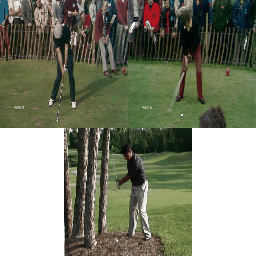
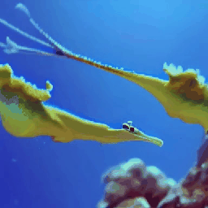
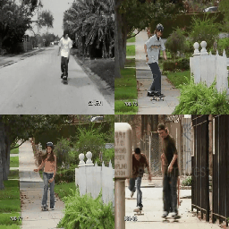
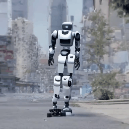
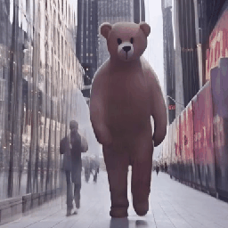
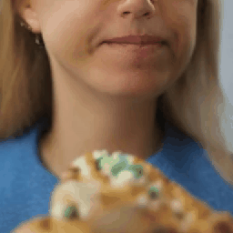
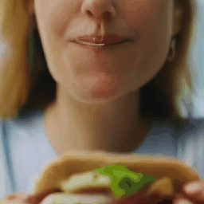

  <h1 align="center">Separate Motion from Appearance: Customizing Motion via Customizing Text-to-Video Diffusion Models </h1>
  <h3 align="center">Video Resluts </h3>

## Customization on Sports
<table class="center"> 
<tr>
  <td style="text-align:center;"><b>Reference Videos</b></td>
  <td style="text-align:center;" colspan="3"><b>Edited Videos</b></td>
</tr>
<tr>
  <td style="text-align:center;"></td>
  <td style="text-align:center;"></td>
  <td style="text-align:center;"></td>
  <td style="text-align:center;"></td>
</tr>
<tr>
  <td width=25% style="text-align:center;color:gray;">"A person is walking."</td>
  <td width=25% style="text-align:center;">"A cowboy is walking in the wild west."
  <td width=25% style="text-align:center;">"A robot is walking in a cyberpunk city."
  <td width=25% style="text-align:center;">"A wizard is walking in a_ mystical forest." 
</tr>
<tr>
  <td style="text-align:center;"></td>
  <td style="text-align:center;"></td>
  <td style="text-align:center;"></td>
  <td style="text-align:center;"></td>
</tr>
<tr>
  <td width=25% style="text-align:center;color:gray;">"A person is riding a bicycle."</td>
  <td width=25% style="text-align:center;">"A panda is riding bicycle in a garden."
  <td width=25% style="text-align:center;">"A girl is riding a bicycle in a country road." 
  <td width=25% style="text-align:center;">"Iron Man is riding a bicycle in a city."
</tr>
<tr>
  <td style="text-align:center;"></td>
  <td style="text-align:center;"></td>
  <td style="text-align:center;"></td>
  <td style="text-align:center;"></td>
</tr>
<tr>
  <td width=25% style="text-align:center;color:gray;">"A person is skateboarding."</td>
  <td width=25% style="text-align:center;">"An astronaut is skateboarding on Mars."
  <td width=25% style="text-align:center;">"A teddy bear skateboarding in Times Square New York." 
  <td width=25% style="text-align:center;">"A robot is skateboarding in a cyberpunk city."
</tr>
<tr>
  <td style="text-align:center;"></td>
  <td style="text-align:center;"></td>
  <td style="text-align:center;"></td>
  <td style="text-align:center;"></td>
</tr>
<tr>
  <td width=25% style="text-align:center;color:gray;">"A monkey is playing golf on a field full of flowers."</td>
  <td width=25% style="text-align:center;">"An astronaut is skateboarding on Mars."
  <td width=25% style="text-align:center;">"A bear is playing golf in a garden." 
  <td width=25% style="text-align:center;">"Iron Man is playing golf in the square."
</tr>
</table>

## Customization on Cinematic Shots
<table class="center"> 
<tr>
  <td style="text-align:center;"><b>Reference Videos</b></td>
  <td style="text-align:center;" colspan="3"><b>Edited Videos</b></td>
</tr>
<tr>
  <td style="text-align:center;"></td>
  <td style="text-align:center;"></td>
  <td style="text-align:center;"></td>
  <td style="text-align:center;"></td>
</tr>
<tr>
  <td width=25% style="text-align:center;color:gray;">"A cup in a lab captured with a zoom in."</td>
  <td width=25% style="text-align:center;">"A wolf standing on a snowy mountain captured with a zoom in."
  <td width=25% style="text-align:center;">"An eagle standing on the edge of a cliff captured with a zoom in."
  <td width=25% style="text-align:center;">"A wizard standing in a mysterious forest captured with a zoom in." 
</tr>
<tr>
  <td style="text-align:center;"><b>Reference Videos</b></td>
  <td style="text-align:center;" colspan="3"><b>Edited Videos</b></td>
</tr>
<tr>
  <td style="text-align:center;"></td>
  <td style="text-align:center;"></td>
  <td style="text-align:center;"></td>
  <td style="text-align:center;"></td>
</tr>
<tr>
  <td width=25% style="text-align:center;color:gray;">"A man standing in room captured with a zoom out."</td>
  <td width=25% style="text-align:center;">"A wolf standing on a snowy mountain captured with a zoom out."
  <td width=25% style="text-align:center;">"An eagle standing on the edge of a cliff captured with a zoom out."
  <td width=25% style="text-align:center;">"A wizard standing in a mysterious forest captured with a zoom out." 
</tr>
<tr>
  <td style="text-align:center;"><b>Reference Videos</b></td>
  <td style="text-align:center;" colspan="3"><b>Edited Videos</b></td>
</tr>
<tr>
  <td style="text-align:center;"></td>
  <td style="text-align:center;"></td>
  <td style="text-align:center;"></td>
  <td style="text-align:center;"></td>
</tr>
<tr>
  <td width=25% style="text-align:center;color:gray;">"A cup in a lab captured with a dolly zoom."</td>
  <td width=25% style="text-align:center;">"A wolf standing on a snowy mountain captured with a dolly zoom."
  <td width=25% style="text-align:center;">"An eagle standing on the edge of a cliff captured with a dolly zoom."
  <td width=25% style="text-align:center;">"A wizard standing in a mysterious forest captured with a dolly zoom." 
</tr>
</table>

## Customization on One-Shot
<table class="center"> 
<tr>
  <td style="text-align:center;"><b>Reference Videos</b></td>
  <td style="text-align:center;" colspan="3"><b>Edited Videos</b></td>
</tr>
<tr>
  <td style="text-align:center;"></td>
  <td style="text-align:center;"></td>
  <td style="text-align:center;"></td>
  <td style="text-align:center;"></td>
</tr>
<tr>
  <td width=25% style="text-align:center;color:gray;">"A car is running on the road."</td>
  <td width=25% style="text-align:center;">"A horse is running in a forest."
  <td width=25% style="text-align:center;">"A tank is running on the road."
  <td width=25% style="text-align:center;">"A dog is running in a garden." 
</tr>
<tr>
  <td style="text-align:center;" colspan="1"><b>Reference Videos</b></td>
  <td style="text-align:center;" colspan="1"><b>Edited Videos</b></td>
  <td style="text-align:center;" colspan="1"><b>Reference Videos</b></td>
  <td style="text-align:center;" colspan="1"><b>Edited Videos</b></td>
</tr>
<tr>
  <td style="text-align:center;"></td>
  <td style="text-align:center;"></td>
  <td style="text-align:center;"></td>
  <td style="text-align:center;"></td>
</tr>
<tr>
  <td width=25% style="text-align:center;color:gray;">"A ship sails on the sea during sunset."</td>
  <td width=25% style="text-align:center;">"A floating island sails on the sea during sunset."
  <td width=25% style="text-align:center;">"Two grey sharks swim in the blue ocean on a coral reef." 
  <td width=25% style="text-align:center;">"Two sea dragons swim in the blue ocean on a coral reef."
</tr>

<tr>
  <td style="text-align:center;" colspan="1"><b>Reference Videos</b></td>
  <td style="text-align:center;" colspan="1"><b>Edited Videos</b></td>
  <td style="text-align:center;" colspan="1"><b>Reference Videos</b></td>
  <td style="text-align:center;" colspan="1"><b>Edited Videos</b></td>
</tr>
<tr>
  <td style="text-align:center;"></td>
  <td style="text-align:center;"></td>
  <td style="text-align:center;"></td>
  <td style="text-align:center;"></td>
</tr>
<tr>
  <td width=25% style="text-align:center;color:gray;">"A man is surfing inside the barrel of a wave."</td>
  <td width=25% style="text-align:center;">"A bear is surfing inside the barrel of a wave."
  <td width=25% style="text-align:center;">"A women is eating a pizza with various toppings." 
  <td width=25% style="text-align:center;">"A woman is eating a sandwich with various toppings."
</tr>

</table>

## Comparisions to Baseline

<table style="width:100%; table-layout:fixed; border-collapse:collapse; border:1px solid #ccc;">
  <colgroup>
    <col style="width:16.6%;">
    <col style="width:16.6%;">
    <col style="width:16.6%;">
    <col style="width:16.6%;">
    <col style="width:16.6%;">
    <col style="width:16.6%;">
  </colgroup>
  <tr>
    <td style="text-align:center;" colspan="1"><b>Reference</b></td>
    <td style="text-align:center;" colspan="1"><b>Baseline[1]</b></td>
    <td style="text-align:center;" colspan="1"><b>Ours</b></td>
    <td style="text-align:center;" colspan="1"><b>Reference</b></td>
    <td style="text-align:center;" colspan="1"><b>Baseline[1]</b></td>
    <td style="text-align:center;" colspan="1"><b>Ours</b></td>
  </tr>
  <tr>
    <td style="text-align:center;"></td>
    <td style="text-align:center;"></td>
    <td style="text-align:center;"></td>
    <td style="text-align:center;"></td>
    <td style="text-align:center;"></td>
    <td style="text-align:center;"></td>
  </tr>
  <tr>
    <td style="text-align:center; color:gray;">"A person is walking."</td>
    <td style="text-align:center;">"A teddy bear is walking in Times Square New York."</td>
    <td style="text-align:center;">"A teddy bear is walking in Times Square New York."</td>
    <td style="text-align:center; color:gray;">"A person is walking."</td>
    <td style="text-align:center;">"A teddy bear is walking in Times Square New York."</td>
    <td style="text-align:center;">"A teddy bear is walking in Times Square New York."</td>
  </tr>

  <tr>
    <td style="text-align:center; width:16.6%;"><b>Reference</b></td>
    <td style="text-align:center; width:16.6%;"><b>Baseline[1]</b></td>
    <td style="text-align:center; width:16.6%;"><b>Ours</b></td>
    <td style="text-align:center; width:16.6%;"><b>Reference</b></td>
    <td style="text-align:center; width:16.6%;"><b>Baseline[1]</b></td>
    <td style="text-align:center; width:16.6%;"><b>Ours</b></td>
  </tr>
  <tr>
    <td style="text-align:center; width:16.6%;"></td>
    <td style="text-align:center; width:16.6%;"></td>
    <td style="text-align:center; width:16.6%;"></td>
    <td style="text-align:center; width:16.6%;"></td>
    <td style="text-align:center; width:16.6%;"></td>
    <td style="text-align:center; width:16.6%;"></td>
  </tr>
  <tr>
    <td style="text-align:center; width:16.6%; color:gray;">"A person is walking."</td>
    <td style="text-align:center; width:16.6%;">"A teddy bear is walking in Times Square New York."</td>
    <td style="text-align:center; width:16.6%;">"A teddy bear is walking in Times Square New York."</td>
    <td style="text-align:center; width:16.6%; color:gray;">"A person is walking."</td>
    <td style="text-align:center; width:16.6%;">"A teddy bear is walking in Times Square New York."</td>
    <td style="text-align:center; width:16.6%;">"A teddy bear is walking in Times Square New York."</td>
  </tr>

  <tr>
    <td style="text-align:center; width:16.6%;"></td>
    <td style="text-align:center; width:16.6%;"></td>
    <td style="text-align:center; width:16.6%;"></td>
    <td style="text-align:center; width:16.6%;"></td>
    <td style="text-align:center; width:16.6%;"></td>
    <td style="text-align:center; width:16.6%;"></td>
  </tr>
  <tr>
    <td style="text-align:center; width:16.6%; color:gray;">"A person is walking."</td>
    <td style="text-align:center; width:16.6%;">"A teddy bear is walking in Times Square New York."</td>
    <td style="text-align:center; width:16.6%;">"A teddy bear is walking in Times Square New York."</td>
    <td style="text-align:center; width:16.6%; color:gray;">"A person is walking."</td>
    <td style="text-align:center; width:16.6%;">"A teddy bear is walking in Times Square New York."</td>
    <td style="text-align:center; width:16.6%;">"A teddy bear is walking in Times Square New York."</td>
  </tr>

</table>

## Reference
[1] Rui Zhao, Yuchao Gu, Jay Zhangjie Wu, David Junhao Zhang, Jia-Wei Liu, Weijia Wu, Jussi Keppo, and Mike Zheng Shou. Baseline: Motion customization of text-to-video diffusion models. In European Conference on Computer Vision, pages. Springer, 2025.